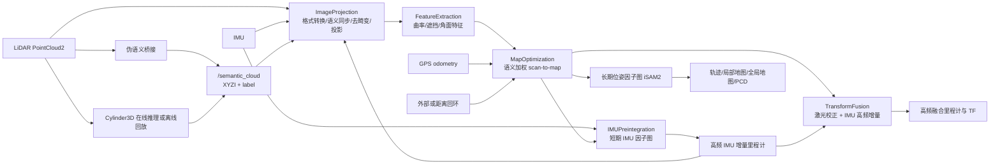

# DSW-LIO-SAM 代码说明

> 本文基于 2026-07-27 的当前工作树代码整理，描述实际实现，而不是只复述上游 LIO-SAM README。项目正在开发中，函数名、参数和实验约束应以代码与配置文件为最终依据。

## 1. 项目概览

DSW-LIO-SAM 是一个 ROS 2 激光惯性 SLAM 包。主体继承 LIO-SAM 的点云去畸变、LOAM 特征提取、scan-to-map 配准、IMU 预积分和 iSAM2 因子图框架，并增加了以下能力：

- 为点云附加 15 类统一语义标签；
- 将类别稳定性转换成 scan-to-map 残差权重；
- 提供几何规则伪语义、Cylinder3D 在线推理和预计算语义回放三种语义来源；
- 用连续退化分数描述激光优化的约束强弱，并将它传给 IMU 因子图选择校正噪声；
- 提供 original、baseline、pseudo、true 四组受控对照实验入口；
- 提供语义帧生成、对齐、回放、轨迹统计和配置校验工具。

当前实验配置针对 Newer College 的 Ouster OS1-64 数据：点云 `/os1_cloud_node/points`、IMU `/os1_cloud_node/imu`、64 线、水平分辨率 1024。核心 C++ 代码仍保留 Velodyne、Ouster 和 Livox 三类传感器分支。

## 2. 总体架构



系统维护两套相互反馈但职责不同的图：

1. `mapOptimization.cpp` 中的长期位姿图保存全部关键帧，融合激光里程计、GPS 和回环约束。
2. `imuPreintegration.cpp` 中的短期 IMU 图估计位姿、速度和 IMU bias；它使用激光增量里程计校正，并每 100 个状态重置一次以控制计算量。

## 3. 目录与职责

| 路径 | 作用 |
| --- | --- |
| `src/imageProjection.cpp` | 接收 LiDAR、IMU、IMU 增量里程计和语义点云，完成格式适配、时间同步、去畸变和距离图投影。 |
| `src/featureExtraction.cpp` | 计算曲率、剔除不稳定邻域，提取带语义标签的角点与面点。 |
| `src/mapOptimization.cpp` | 构建局部地图，执行语义加权 scan-to-map，维护关键帧因子图、GPS、回环、地图发布和保存服务。 |
| `src/imuPreintegration.cpp` | 包含 `IMUPreintegration` 和 `TransformFusion` 两个节点，负责 IMU 因子图、高频预测和里程计融合。 |
| `src/semanticBridge.cpp` | 当前安装使用的 C++ 伪语义发布器。 |
| `include/dsw_lio_sam/utility.hpp` | 公共点类型、语义定义、参数服务器、QoS、IMU 外参变换和通用函数。 |
| `msg/CloudInfo.msg` | 前端各阶段之间的帧级元数据和点云载体。 |
| `srv/SaveMap.srv` | 地图保存服务协议。 |
| `semantic_bridge/` | Cylinder3D 在线 IPC 节点、离线语义回放及其纯函数工具。 |
| `Cylinder3D/` | Cylinder3D 网络、数据集、训练、离线推理和配置。 |
| `launch/` | 普通运行、四组实验和在线 Cylinder3D 的启动文件。 |
| `config/` | ROS 参数、QoS、URDF 和 RViz 配置。 |
| `tools/` | 点云导出、清单生成、标签合并、配置校验和轨迹分析。 |
| `test/` | 语义权重、时间同步、回放对齐、推理 profile 和并行数据结构测试。 |

`semantic_bridge/semantic_bridge.py` 是较早的 Python 伪语义实现，CMake 当前没有安装它；`experiment.launch.py` 的 pseudo 模式启动的是 `src/semanticBridge.cpp` 编译出的节点。

## 4. 公共类型、参数与 QoS

### 4.1 点类型

- `PointType` 是 `pcl::PointXYZI`，用于普通几何点、地图和可视化。
- `PointTypeL` 是自定义 `PointXYZIL`，字段为 `x/y/z/intensity/label`，用于语义点云和当前帧特征。
- `PointTypePose` 在 `mapOptimization.cpp` 中定义，保存关键帧的 `x/y/z/roll/pitch/yaw/time`；其 `intensity` 字段被用作关键帧索引。

带标签体素降采样由 `voxelDownsampleSemanticCloud()` 实现。每个体素保留一个原始点，不对离散标签求平均，因此不会产生不存在的类别编号。哈希容器的遍历顺序没有稳定排序保证。

### 4.2 语义类别和权重

`SemanticLabel` 统一定义 0 到 14 的类别。优化使用稳定性分数 `S(c)` 和权重：

```text
w_i = max(0.05, 1 + alpha * (S(c_i) - 0.5))
```

| 类别 | ID | S(c) | alpha=0.5 时权重 |
| --- | ---: | ---: | ---: |
| UNKNOWN | 0 | 0.50 | 1.000 |
| CAR / TRUCK / BUS / BICYCLE / MOTORCYCLE | 1/2/3/5/6 | 0.10 | 0.800 |
| PERSON | 4 | 0.05 | 0.775 |
| BUILDING / WALL | 7/14 | 1.00 | 1.250 |
| ROAD / POLE | 8/12 | 0.95 | 1.225 |
| SIDEWALK / TERRAIN / FENCE | 9/10/13 | 0.90 | 1.200 |
| TREE | 11 | 0.60 | 1.050 |

`alpha=0` 时所有点权重都为 1。当前四组对照实验中，original 恢复 PCL 质心体素滤波和二值退化传递，baseline 是 DSW 无语义消融，pseudo 和 true 都使用 `alpha=0.5`。

### 4.3 `CloudInfo` 消息

`CloudInfo.msg` 在一帧处理链中携带：

- 各扫描线的有效起止索引；
- 每个提取点的距离图列号和量测距离；
- IMU 是否可用、帧首姿态；
- IMU 预积分里程计是否可用及其初始位姿猜测；
- 去畸变点云、角点云和面点云；
- 与提取点对齐的语义标签和预计算语义权重。

当前后端实际从特征点的 `label` 重新计算权重；`point_semantic_weights` 会在 ImageProjection 中生成，但 FeatureExtraction 发布前会清空该数组，因此它目前不是后端的直接输入。

### 4.4 参数服务器

所有 C++ 节点继承 `ParamServer`，因此共享同一套 topic、frame、传感器、IMU、特征、地图、回环和语义参数。IMU 数据进入各节点前由 `imuConverter()` 使用：

- `extrinsicRot` 旋转加速度与角速度；
- `extrinsicRPY` 旋转姿态四元数；
- 当输入四元数范数过小时，将姿态回退为单位四元数，以允许 6 轴 IMU 数据继续运行，但无法提供可靠的绝对初始姿态。

### 4.5 QoS

| 名称 | depth | reliability | 用途 |
| --- | ---: | --- | --- |
| `qos` | 1 | reliable | 普通里程计和控制消息。 |
| `qos_imu` | 2000 | best effort | 高频 IMU 和 IMU 里程计。 |
| `qos_lidar` | 1024 | reliable | 原始 LiDAR。 |
| `qos_point_cloud_pipeline` | 1024 | reliable | 去畸变、语义和特征流水线。 |

离线 bag 播放需要让 `/os1_cloud_node/points` 与 reliable 订阅匹配；仓库提供 `config/rosbag_qos.yaml`。

## 5. 核心处理流程

### 5.1 ImageProjection：同步、去畸变和距离图

入口是 `ImageProjection::cloudHandler()`，每帧顺序如下：

1. `cachePointCloud()` 缓存三帧后再取最早帧，以给 IMU 数据留出到达时间。
2. 按传感器类型读取点云。Ouster 的纳秒字段 `t` 被转换成相对秒；Velodyne/Livox 使用公共格式。
3. 检查 `ring` 和点内时间字段。没有时间字段时允许继续，但不做点级去畸变；缺失必要 ring 时会关闭 ROS。
4. `deskewInfo()` 要求 IMU 队列完整覆盖扫描起止时间，否则丢弃当前帧并等待后续数据。
5. 语义开启时，`cacheSemanticCloud()` 查找与 LiDAR 时间戳相差不超过 1 ms 的语义帧，最长等待 5 秒。
6. 对每个原始 LiDAR 点在语义点云中做 1-NN 查询，只有距离不超过 5 cm 才视为匹配；按匹配数计算 coverage。
7. 当 coverage 低于 `minimumSemanticCoverage` 时，`requireSemanticCloud=true` 会拒绝该 LiDAR 帧，否则保留 UNKNOWN/等权结果继续处理。
8. 使用 IMU 角速度积分并插值每个点的旋转，将点变换到帧首坐标系。平移补偿代码当前关闭，所以实际执行的是旋转去畸变。
9. 将点投影到 `N_SCAN x Horizon_SCAN` 距离图。同一像素只保留先到达的点，并同步保存其 label 和 weight。
10. 按扫描线顺序压缩有效点，发布去畸变点云和 `CloudInfo`。

ImageProjection 使用多线程执行器，并把 LiDAR、IMU、里程计和语义订阅放入互斥 callback group。语义条件变量的等待不会阻止语义回调写入队列。

### 5.2 FeatureExtraction：LOAM 角面特征

ImageProjection 分别发布去畸变点云和 `CloudInfo`。FeatureExtraction 为两条输入维护独立队列，再按 1 ms 时间容差配对，避免依赖回调到达顺序。

每帧执行：

1. 使用左右各 5 个相邻点的距离差计算曲率；
2. 标记深度突变造成的遮挡点，以及与扫描方向近似平行的不稳定点；
3. 将每条 scan 均分为 6 段，避免特征集中在局部；
4. 每段从高曲率端最多选 20 个角点，并屏蔽其左右各 5 个邻点；
5. 从低曲率端选面点，其余非角点也加入面点候选；
6. 使用保留标签的体素降采样压缩面点；
7. 发布带 `label` 字段的角点、面点和新的 `CloudInfo`。

代码中保留了 `isDynamicLabel()`，但角点和面点选择里的动态类别硬删除条件已被注释。当前策略是保留动态点，在 MapOptimization 中降低其残差权重。

### 5.3 MapOptimization：语义加权 scan-to-map

`laserCloudInfoHandler()` 按 `mappingProcessInterval` 限频。一次后端处理顺序为：

```text
updateInitialGuess
  -> extractSurroundingKeyFrames
  -> downsampleCurrentScan
  -> scan2MapOptimization
  -> saveKeyFramesAndFactor
  -> correctPoses
  -> publishOdometry / publishFrames
```

初值优先级为：第一帧 IMU 姿态、后续 IMU 预积分位姿增量、仅 IMU 旋转增量。局部地图由当前关键帧附近 `surroundingKeyframeSearchRadius` 内的历史关键帧组成，同时补入最近 10 秒关键帧以覆盖原地旋转情形。

scan-to-map 的核心约束：

- 角点：查询地图中 5 个近邻，要求最远近邻平方距离小于 1，且最大特征值大于次大特征值 3 倍；残差为点到拟合直线的距离。
- 面点：查询地图中 5 个近邻，拟合平面并要求每个近邻到平面的距离不超过 0.2 m；残差为当前点到平面的距离。
- 每次最多迭代 30 次；有效残差少于 50 时本轮求解失败。

语义权重在构造正规方程前以 `sqrt(w_i)` 同时缩放 Jacobian 行和残差：

```text
J'_i = sqrt(w_i) * J_i
r'_i = sqrt(w_i) * r_i

J'^T J' = J^T W J
J'^T r' = J^T W r
```

因此静态结构对位姿求解的影响增大，动态物体影响减小，但没有被完全移除。

第一次迭代会对 `J^T W J` 做特征分解。低于固定阈值 100 的方向被投影掉，同时根据退化维度数和最小特征值计算 `[0,1]` 连续退化分数。该分数写入 `mapping/odometry_incremental.pose.covariance[0]`；`degeneracyThreshold` 参数在 IMUPreintegration 中将它转换为“正常/退化”校正噪声选择，而不是替代这里固定的特征值阈值。

### 5.4 关键帧与长期因子图

关键帧满足任一条件才保存：相对上一关键帧旋转超过 `surroundingkeyframeAddingAngleThreshold`，或平移超过 `surroundingkeyframeAddingDistThreshold`。Livox 还允许时间间隔超过 1 秒直接保存。

长期 iSAM2 图包含：

- 第一帧位姿先验；
- 相邻关键帧的激光里程计 `BetweenFactor<Pose3>`；
- 可选 `GPSFactor`；
- ICP 或外部检测产生的回环 `BetweenFactor<Pose3>`。

GPS 只有在轨迹已移动 5 m、当前位姿协方差较大、GPS 协方差合格、时间与激光帧相差不超过 0.2 秒且距离上一个 GPS 因子超过 5 m 时才加入。关闭 `useGpsElevation` 时只使用当前估计高度。

距离回环在指定半径内搜索时间差足够大的历史关键帧，用当前关键帧与历史子地图做 ICP。ICP 最多 100 次迭代，fitness 必须低于 `historyKeyframeFitnessScore`。回环或 GPS 加入后，历史位姿和全局路径会整体重算。

保存为地图的关键帧使用普通 `PointType`，标签不会写入长期地图；语义只在当前帧 scan-to-map 残差构建时生效。

### 5.5 IMUPreintegration：短期 IMU 图

`IMUPreintegration` 同时维护两个预积分器：

- `imuIntegratorOpt_`：在相邻激光校正之间积累 IMU，构建 `ImuFactor`；
- `imuIntegratorImu_`：使用最新优化 bias 对尚未被校正的 IMU 重新积分，并逐条发布高频预测。

状态变量为 `X(k)` 位姿、`V(k)` 速度和 `B(k)` bias。每次激光校正加入：

- 上一状态到当前状态的 `ImuFactor`；
- bias 随机游走的 `BetweenFactor`；
- 当前激光位姿的 `PriorFactor<Pose3>`。

激光增量里程计中的连续退化分数大于 `degeneracyThreshold` 时使用较宽松的 `correctionNoise2`，减少退化激光位姿对 IMU 状态的强制拉动。图每到 100 个状态时用当前边缘协方差重建为新先验。速度模长超过 30 m/s，或加速度计/陀螺仪 bias 范数超过 1 时，系统判定发散并重置。

### 5.6 TransformFusion：高频输出

TransformFusion 接收低频 `mapping/odometry` 和高频 IMU 增量里程计。它保留最近一次激光优化位姿，再乘上此后累积的 IMU 相对运动，得到当前高频里程计，发布：

- 参数 `odomTopic`，默认 `dsw_lio_sam/odometry/imu`；
- `dsw_lio_sam/imu/path`；
- `odometryFrame -> baselinkFrame` TF。

若 `lidarFrame != baselinkFrame`，会查询静态 TF 并把激光位姿转换到 base link。

## 6. 语义来源

### 6.1 几何规则伪语义

`src/semanticBridge.cpp` 保持原始点顺序和时间戳，按以下优先级赋值：

原始强度先按当前帧最大值归一化到 `[0, 1]`，再按以下优先级赋值：

1. `z < pseudoGroundMaxZ`：TERRAIN；
2. `z > pseudoCanopyMinZ`：TREE；
3. `z > pseudoStructureMinZ` 或归一化强度 `> 0.8`：BUILDING；
4. 其他：ROAD。

三个高度阈值必须满足 `groundMaxZ < structureMinZ < canopyMinZ`。退化检测始终使用未加权几何 Hessian；语义权重仅参与加权最小二乘，避免标签分布改变固定退化阈值的含义。

它用于验证语义加权机制和构造对照组，不代表人工真值。

### 6.2 Cylinder3D 在线推理

`semantic.launch.py` 启动 `run_cylinder3d_node`：

- ROS 2 包装节点由 `/usr/bin/python3` 运行，保证能加载 Humble 的 `rclpy`；
- 推理子进程从 `~/miniconda3`、`~/anaconda3` 或 `/opt/conda` 查找名为 `cylinder3d` 的环境；
- 两个进程通过 stdin/stdout 二进制协议交换 `<int64 点数><float32 xyz><float32 intensity>` 和 `<int64 标签数><uint32 labels>`；
- 输入点先过滤非有限值、0.1 m 内点和 `rho_filter` 外点，强度按帧归一化；
- 推理结果经 SemanticKITTI 原始标签到 DSW 15 类的 LUT 映射，再恢复到原始点数和顺序发布。

Cylinder3D 将笛卡尔坐标转为柱坐标 `(rho, phi, z)`，体素化后构造 9 维点特征并送入非对称稀疏 3D 卷积网络。在线 IPC 默认使用与 checkpoint 配套的体素 profile；只有显式关闭 `use_config_voxel_profile` 才采用 launch 中的 `z_min/z_max/rho_max` 覆盖值。

`resolve_inference_profile()` 的选择规则很重要：

- 存在 `model_save_dir/nc_finetuned.pt` 时，使用 Newer College 微调模型和配置中的 `z=[-5,15]` 体素范围；
- 否则回退到 `pretrained/model_save_backup.pt`，并强制使用其训练时的 SemanticKITTI `z=[-4,2]` 范围，避免 checkpoint 与预处理空间不一致。

### 6.3 预计算语义回放

true 实验使用 `semantic_replay_node.py`。语义目录必须包含：

```text
semantic_dir/
  000000.bin ...       # x/y/z/intensity/label，每点 20 字节
  frames.csv            # filename/stamp_ns/point_count/original_point_count
  inference_metadata.json
```

节点先校验模型来源与预处理 profile，再按 LiDAR 时间戳查找最近语义帧，默认容差 1 ms。回放工具可按坐标恢复过滤前的原始点顺序，默认要求至少 95% 有效点匹配。PointCloud2 解析支持带 row padding 的有组织点云，并支持 FLOAT32、UINT16 或 UINT8 强度字段。

回放使用独立 worker，订阅回调只负责入队，避免大帧对齐阻塞 ROS executor。当 bag 输入静默 5 秒且实际发布帧数少于清单总数时，节点以失败退出，`experiment.launch.py` 随即关闭整组 true 实验，避免保存不完整结果。

## 7. ROS 接口

### 7.1 主要 topic

| Topic | 类型 | 生产者 | 消费者/含义 |
| --- | --- | --- | --- |
| `pointCloudTopic` | `sensor_msgs/PointCloud2` | LiDAR/bag | ImageProjection、伪语义或 Cylinder3D。 |
| `imuTopic` | `sensor_msgs/Imu` | IMU/bag | ImageProjection、IMUPreintegration。 |
| `semanticCloudTopic` | `sensor_msgs/PointCloud2` | 语义节点 | ImageProjection；字段为 XYZI+label。 |
| `<odomTopic>_incremental` | `nav_msgs/Odometry` | IMUPreintegration | ImageProjection 去畸变初值、TransformFusion；默认是 `dsw_lio_sam/odometry/imu_incremental`。 |
| `dsw_lio_sam/deskew/cloud_deskewed` | `PointCloud2` | ImageProjection | FeatureExtraction。 |
| `dsw_lio_sam/deskew/cloud_info` | `CloudInfo` | ImageProjection | FeatureExtraction。 |
| `dsw_lio_sam/feature/cloud_corner` | `PointCloud2` | FeatureExtraction | 调试/可视化；后端实际使用 `CloudInfo` 内嵌副本。 |
| `dsw_lio_sam/feature/cloud_surface` | `PointCloud2` | FeatureExtraction | 调试/可视化；后端实际使用 `CloudInfo` 内嵌副本。 |
| `dsw_lio_sam/feature/cloud_info` | `CloudInfo` | FeatureExtraction | MapOptimization。 |
| `dsw_lio_sam/mapping/odometry` | `nav_msgs/Odometry` | MapOptimization | TransformFusion 和外部消费者。 |
| `dsw_lio_sam/mapping/odometry_incremental` | `nav_msgs/Odometry` | MapOptimization | IMUPreintegration 的激光校正，covariance[0] 存退化分数。 |
| `gpsTopic` | `nav_msgs/Odometry` | GPS 转换节点 | MapOptimization 的可选 GPS 因子。 |
| `lio_loop/loop_closure_detection` | `Float64MultiArray` | 外部回环器 | 两个时间戳组成的可选回环候选。 |

地图相关输出还包括 `mapping/trajectory`、`mapping/path`、`mapping/map_local`、`mapping/map_global`、`mapping/cloud_registered` 和回环可视化 marker。

### 7.2 TF 和 frame

`run.launch.py` 发布静态 `map -> odom`，URDF 发布 `base_link -> chassis_link -> imu_link -> laser_sensor_frame` 以及 `base_link -> lidar_link`。TransformFusion 独占发布 `odometryFrame -> baselinkFrame`，避免与 URDF 共同形成重复父节点或 TF 环路。

实验配置的主要 frame 是 `map`、`odom`、`base_link` 和 `lidar_link`。修改 URDF 或外参时，应同时检查参数中的 frame 名称，避免生成两条含义冲突的 TF 链。

### 7.3 地图保存服务

```bash
ros2 service call /dsw_lio_sam/save_map dsw_lio_sam/srv/SaveMap \
  "{resolution: 0.2, destination: /dsw_lio_sam_results/manual/}"
```

服务保存 `trajectory.pcd`、`transformations.pcd`、`CornerMap.pcd`、`SurfMap.pcd` 和 `GlobalMap.pcd`。`destination` 会拼接在当前用户的 HOME 后面；实现会先递归删除目标目录再重建，因此必须使用专用结果目录。`resolution=0` 表示不对角点和面点地图做额外降采样。

## 8. 启动与实验模式

### 8.1 构建

目标环境是 Ubuntu 22.04 + ROS 2 Humble，主要依赖为 PCL、OpenCV、GTSAM 4.1、Eigen、OpenMP、tf2 和 ROS 2 消息/接口包。

```bash
cd <ros2_ws>
colcon build --packages-select dsw_lio_sam --symlink-install
source install/setup.bash
```

仓库的 Dockerfile 构建的是上游 LIO-SAM ros2 分支，而不是复制当前 DSW-LIO-SAM 工作树；它可作为依赖环境参考，不能直接视为本仓库代码的可复现实验镜像。

### 8.2 普通入口

```bash
ros2 launch dsw_lio_sam run.launch.py
ros2 bag play <bag-dir> --clock \
  --qos-profile-overrides-path <repo>/config/rosbag_qos.yaml
```

`run.launch.py` 默认加载 `config/params.yaml`。该文件当前启用语义、`alpha=2.0` 和回环，但 `requireSemanticCloud=false`；它是开发运行配置，不是四组受控实验之一。

### 8.3 四组受控实验

运行前先校验四套参数只在处理变量上不同：

```bash
python3 tools/validate_experiment_configs.py
```

| 模式 | 参数文件 | 语义来源 | 关键设置 |
| --- | --- | --- | --- |
| `original` | `params_original_lio_sam.yaml` | 无 | `originalLioSamMode=true`、PCL 质心体素滤波、二值退化传递。 |
| `baseline` | `params_baseline.yaml` | 无 | DSW 路径，`semanticEnabled=false`、`alpha=0`、不要求语义。 |
| `pseudo` | `params_pseudo_semantic.yaml` | C++ 几何规则桥接 | `semanticEnabled=true`、`alpha=0.5`、coverage >= 0.95。 |
| `true` | `params_true_semantic.yaml` | 预计算 Cylinder3D 回放 | `semanticEnabled=true`、`alpha=0.5`、coverage >= 0.95，必须提供 `semantic_dir`。 |

四套配置都关闭回环，便于隔离实验处理变量：

```bash
ros2 launch dsw_lio_sam experiment.launch.py experiment:=original

ros2 launch dsw_lio_sam experiment.launch.py experiment:=baseline

ros2 launch dsw_lio_sam experiment.launch.py experiment:=pseudo

ros2 launch dsw_lio_sam experiment.launch.py \
  experiment:=true \
  semantic_dir:=/absolute/path/to/semantic_dir
```

另一个终端统一使用相同 bag、播放速率、`--clock` 和 QoS 覆盖。四组输出目录分别由对应参数文件的 `savePCDDirectory` 指定。

## 9. Cylinder3D 离线数据链

建议的数据流为：

```text
ROS bag / PCD
  -> XYZI .bin
  -> frames.csv
  -> Cylinder3D .label + inference_metadata.json
  -> XYZI+label .bin
  -> semantic_replay_node
```

相关工具：

| 工具 | 作用 |
| --- | --- |
| `tools/extract_bin_from_bag.py` | 在 ROS 2 环境中直接读取 bag 或订阅播放 topic，按 PointCloud2 stride 正确导出 XYZI。 |
| `tools/extract_pc.py` | 基于 `rosbags`/SQLite 的点云导出实现；代码含 ROS1/ROS2 支持函数，当前 CLI 末尾直接调用 ROS2 路径。 |
| `tools/pcd_to_cylinder_bin.py` | 将 PCD 批量转为 Cylinder3D XYZI `.bin`。 |
| `tools/generate_frame_manifest.py` | 从 rosbag2 SQLite 时间戳与现有 bin 生成 `frames.csv`。 |
| `Cylinder3D/demo_folder.py` | 运行文件夹离线推理，输出 `.label` 和带 checkpoint SHA256 的 `inference_metadata.json`。 |
| `tools/merge_semantic_labels.py` | 将 SemanticKITTI 标签映射到 DSW 15 类，合并 XYZI 与 label，并复制清单和元数据。 |

`merge_semantic_labels.py` 输出的每点布局与在线语义 topic 相同：四个 little-endian float32 加一个 uint32 标签，共 20 字节。

## 10. 测试与辅助分析

### 10.1 测试覆盖

```bash
# 纯 Python 测试
python3 -m pytest test/test_semantic_replay.py test/test_inference_profile.py

# ROS 2 / C++ 测试
colcon test --packages-select dsw_lio_sam
colcon test-result --verbose
```

测试主要覆盖：

- 15 类稳定性和权重公式，包括大 alpha 下的正数下限；
- 保留标签的体素降采样；
- 语义帧 1 ms 时间同步；
- 原始点顺序恢复、点数不一致和 coverage 拒绝；
- manifest 与 inference metadata 校验；
- checkpoint 与体素 profile 的绑定；
- 1024 深度 reliable 点云队列；
- OpenMP 并行标记使用可逐字节寻址的 `uint8_t`，避免 `vector<bool>` 位代理竞争。

### 10.2 轨迹工具

- `tools/drift.py` 读取 PCD 轨迹并计算首尾直线距离，只适用于起终点应重合的闭环序列。
- `tools/compare_trajectories.py` 绘制四组硬编码结果路径的 3D/XY/XZ 轨迹和总长度；使用前需要修改文件顶部路径。
- 论文级评估应使用带时间同步和真值对齐的 APE/RPE，不能用首尾漂移代替。

## 11. 实现边界与维护注意事项

1. **时间是首要契约。** LiDAR、IMU、语义和 `/clock` 必须在同一时间基准。语义仅容忍 1 ms 偏差，IMU 必须完整覆盖整帧扫描。
2. **点云字段必须匹配。** Ouster 需要 `ring` 和 `t`；Velodyne 通常需要 `ring` 和 `time`。输入为空或非 dense 的处理仍较严格，驱动侧应先保证数据合法。
3. **平移去畸变未启用。** 代码计算了扫描起止里程计增量，但 `findPosition()` 当前始终返回零。
4. **语义不是地图属性。** 标签随当前特征传到 scan-to-map，但关键帧存储和 PCD 地图会丢弃标签。
5. **动态点没有硬剔除。** `isDynamicLabel()` 存在，但当前特征选择不调用它；实际效果是软降权。
6. **未知语义是中性约束。** UNKNOWN 的稳定性为 0.5，对任意 alpha 权重都为 1，未匹配点不会自动降权。
7. **在线和离线 Cylinder3D 依赖不同运行时。** ROS 包装节点需要系统 Python，torch/spconv 推理需要 `cylinder3d` conda 环境和有效 checkpoint。
8. **预训练模型不是 Newer College 真值。** 回退 checkpoint 是 SemanticKITTI 预训练模型；只有存在微调权重或人工标注时，才能把结果表述为 Newer College 专用语义。
9. **GPS 入口存在但默认 launch 不生成 GPS odometry。** 使用 GPS 时还需外部定位转换节点和正确 TF。
10. **保存目录会被覆盖。** 自动保存和 SaveMap 服务都会清理目标结果目录，实验目录不应与源码或数据集目录重合。
11. **默认开发配置与论文对照配置不同。** 可复现实验应使用 `experiment.launch.py`，不要混用 `params.yaml`。
12. **Dockerfile 不是当前源码镜像。** 若要容器复现本分支，应修改镜像构建流程，把当前包放入工作空间并补充 Cylinder3D 运行时。

## 12. 推荐阅读顺序

第一次接手代码时，建议按以下顺序阅读：

1. `include/dsw_lio_sam/utility.hpp`：先理解公共参数、QoS、点类型和语义公式；
2. `msg/CloudInfo.msg`：理解节点之间如何传递一帧数据；
3. `src/imageProjection.cpp`：掌握传感器格式、时间同步和去畸变；
4. `src/featureExtraction.cpp`：理解 LOAM 特征如何保留标签；
5. `src/mapOptimization.cpp`：跟踪语义权重进入正规方程、退化分数和长期因子图；
6. `src/imuPreintegration.cpp`：理解短期图和高频输出如何接收激光反馈；
7. `launch/experiment.launch.py` 与四套参数：理解实验控制变量；
8. `semantic_bridge/semantic_replay_node.py` 和 Cylinder3D 推理代码：理解语义数据的生产、校验和回放。
